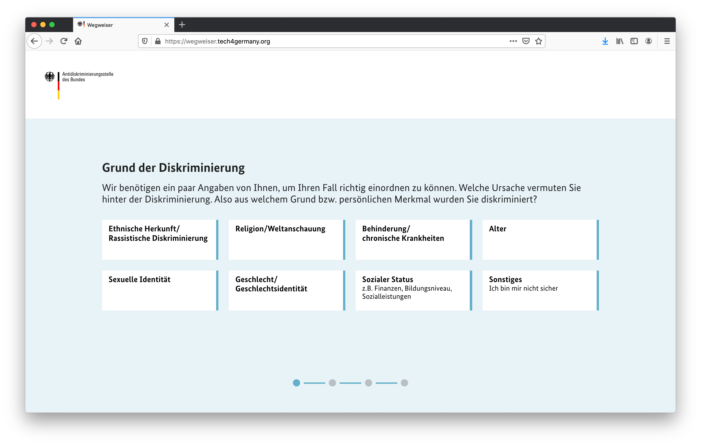
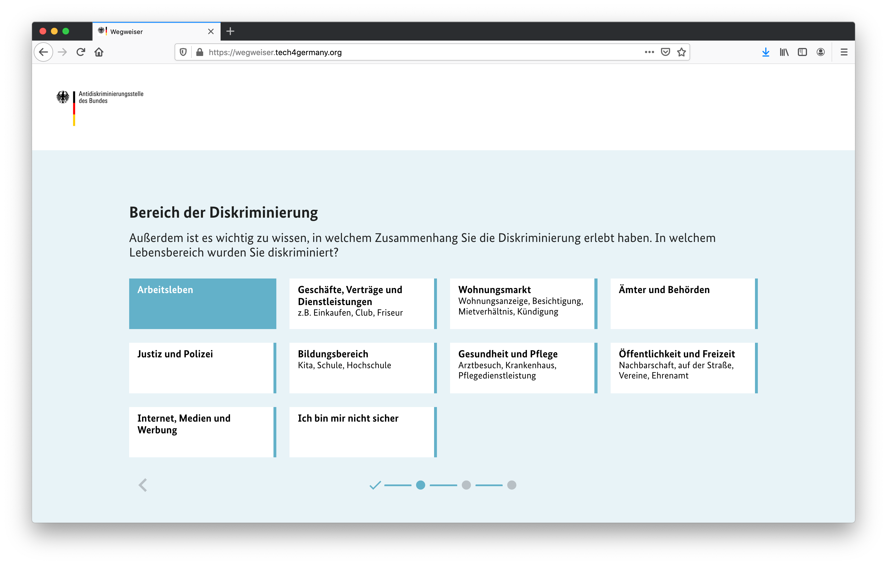
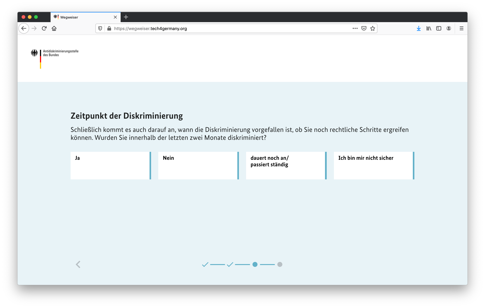
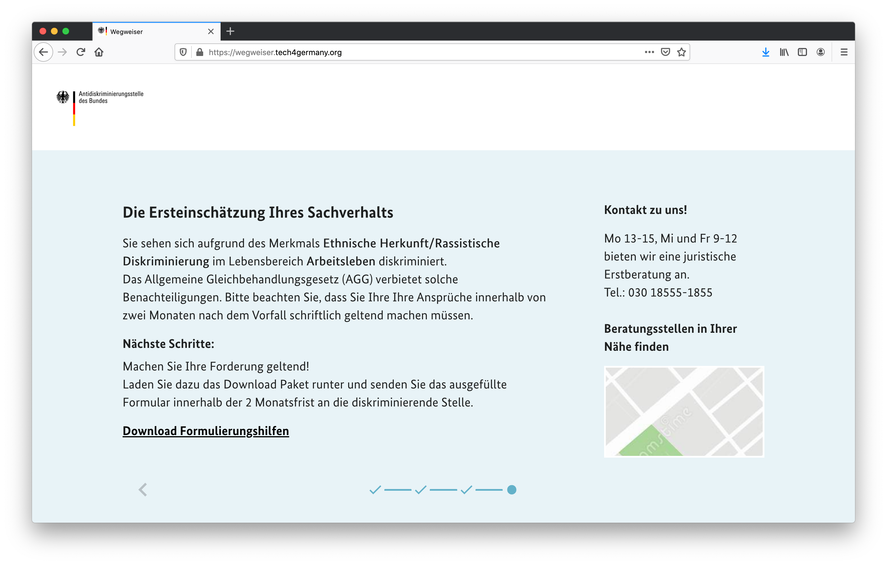
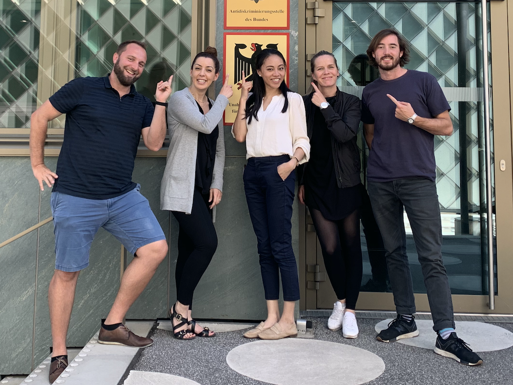

## Wegweiser Antidiskiminierungstelle des Bundes

This repo contains the code for a decision support tool designed to advise people
in taking next steps when approaching the [German Federal Anti-discrimination agency](https://www.antidiskriminierungsstelle.de/DE/Home/home_node.htmle). The project was part of the [Tech4Germany Fellowship](https://tech.4germany.org/) cohorte of 2020. It allows people seeking advice after experiencing an act of discrimination to quickly find relevant information and possible next steps.

:point_right:
Currently, the project is hosted with AWS Amplify and can be accessed [here](https://wegweiser.tech4germany.org/). :point_left:

### Get up and running
______________________

1. Using ssh, clone repo to local enviroment

`git clone git@github.com:tech4germany/ads-prototype.git`

2. Navigate to repo directory and install require node modules

`cd ads-prototype && npm install`

3. Running of app
  * a) For development start with shipped create-react script

    `npm start`
  * b) Build process for production

    `npm run build:alternative`

### Technical Setup
______________________

#### Tech Stack
______________________

##### React Framework

We have used React to supply us with the necessary tools to build an interactive
user interface. The reasons are simple. React is technologically mature and widely used, ensuring excellent community support, and integrates nicely with a range of additional
tools like design frameworks or state handling.

For setting up the basic development infrastructure we have used the create-react-app cli
command. Ideally we would liked to set up necessary infrastructure with a custom
setup for e.g. babbel and wepback to avoid packages that are not necessary and lead to
substantial overhead. However due to time constraints we have resorted to this
solution.

We decided against using a more elaborate react-dom system for routing through the different stages of the application. The application has really only two types of
pages that are able to load content dynamically from a number static files. We
therefor decided to implement a system of state-dependent renderings with less
overhead.

Please find more information [here](https://reactjs.org/).

##### Parcel Bundler
For the production setup we use Parcel as our bundling tool to transpile and minify our
application. We chose Parcel because it is easy to handle, it features great community support comes very light-weight out of the box.

Please find more information [here](https://parceljs.org/).

##### TypeScript as implementation language
Initially the app was built using Javascript but we switched to TypeScript to
ensure greater type security when handling the different kinds of input data that
guide the flow of the application.

Please find more information [here](https://www.typescriptlang.org/).

##### Material UI Design Framework
For building our UI components we used Material UI. There were a few, straight-
forward reasons for our choice. Material UI provides a mature framework with
decent api documentation, it integrates smoothly with react and finally it has
great community support.

We ended up using very few actual design components straight from Material UI.
We did however heavily apply the styling solution *makeStyles* to adapt styles
our custom components. The setup is intuitive and quick to use, which was great
for our short timeframe. For future development stages of the application this
decision might be reversed if deemed necessary.

Please find more information [here](https://material-ui.com/).

##### Unstated-Next State Management
Initially we used a more traditional state handling passing hooks back and forth
through the application. Although this worked fine it was easy to loose the
overview at times and became a little tedious. We therefor decided to implement
a more comprehensive state management system. This is usually done using redux,
which proved a little to much of an overhead for our small application. Instead
we went for unstated-next. This is a little less mature but much smaller
framework that allows us to better separate global state-management from our
UI components.

Please find more information [here](https://github.com/jamiebuilds/unstated-next).

##### Data
The logic determining the flow of the application is set through our state-management
and UI components. The content for individual renderings however is retrieved
from a set of static json files that are stored within the src folder. This allows
us to avoid a more elaborate backend setup with database connections. We have
composed a interface module that handles all interactions with the raw input data.

##### Serverless Hosting with AWS Amplify
Seeing that we do not require an interactive backend and the application can be
served statically. For our prototype we have decided to use AWS Amplify which
provides an easy to use, out of the box serverless hosting.

Please find more information [here](https://aws.amazon.com/de/amplify/).

#### Repository Structure
______________________

src
├── build                   
├── docs                    
├── src                     
├── test                    
├── tools                   
├── LICENSE
└── README.md

### Background
______________________

The Federal Anti-discrimination agency in Germany has a range of responsibilities. It runs programs to increase awareness against discrimination, it funds and directs a number of studies designed to better understand the state of discrimination in Germany and relevant trends and finally, it offers legal advise to people affected by discrimination.

The Tech4Germany fellowship program 2020 was tasked to identify the most pressing challenges currently faced by the legal consultation team and develop a digital solution to improve the service both for the legal consultants and the people seeking help with the agency.

Following an explorative stint where the team analysed the strengths and current challenges, the **Wegweiser** emerged as a solution that has considerable impact and is feasible within the given timeframe of 12 weeks. The **Wegweiser** is a simple decision support tool that allows people seeking advice to better understand the legal situation of their request and their options going forward.

At the moment much of this work, informing and re-directing claimants to better suited institutions, is done manually by highly-trained legal consultants. With an expected decrease in the number of these cases through the **Wegweiser** the consultants will be able to direct their capacities to more intricate cases where their legal expertise is required.

#### What is Tech4Germany

Tech4Germany is a 3-month fellowship program for digital talents under the patronage of the head of the Federal Chancellery, Prof. Dr. Helge Braun. Every year since 2018, the best young talents from the fields of technology, product and design have been working for three months on specific challenges of the federal ministries. In interdisciplinary teams, prototypical software products are developed with agile and user-centered methods.

### User Flow
______________________

The **Wegweiser** is not a complicated tool but allows users through a very reduced flow of questions to arrive at relevant information to their case.

* **Merkmal**: First, a user needs to answer why he/she was discriminated. Possible answers include a persons ethnic background, their age or religious believes.

* **Merkmal Detail**: Conditional on the previous answer a person might need to give a more detailed answer on why he/she was discriminated.

* **Lebensbereich**: Next the user is asked where or in which context the discrimination occurred. This includes the workplace, housing market or the health sector.

* **Lebensbereich Detail**: Again, depending on the previous answer their might be a second, more detailed question to allow the tools to adequately categorise the present case.

* **Frist**: Finally, the user is asked if the case happend within the past two months, which is the timefrime within which a claim needs to be officially registered and communicated. Please note that this questions only appears if the previous answers indicate that the case is in fact relevant under the anti-discrimination law.

* **Ergebnisseite**: The results page contains four elements. First there is a brief text informing the person about the legal situation of their case. Mainly it says whether the case falls under the AGG, which is the legal foundation of the work of the ADS. Second, it provides a download links for documents where this is applicable. Third, it offers the person the possibility to contact the agency directly. The last element is a link to a map containing a number of alternative institutions where people can find help.

### Team
______________________

_Von links nach rechts: Daniel Scheer, Neslihan Kilic, Jingyi Lisa Zhang, Steffi Güthling, Ben Gläser_
